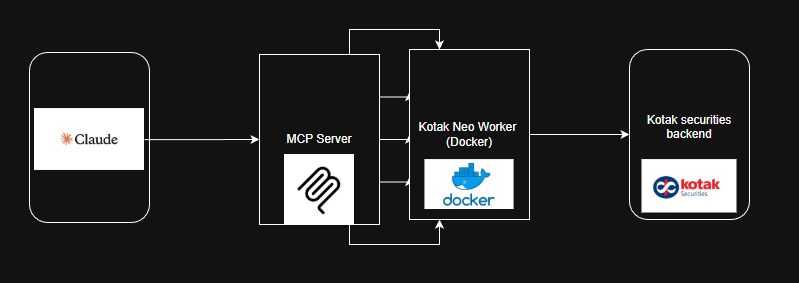

# MCP Server for Kotak Neo Trading
**This repository contains an MCP (Model Context Protocol) server for the Kotak Neo Trading platform, enabling you to trade in natural language through an LLM client such as Claude Desktop.**

**The server acts as a bridge between the MCP client and the Kotak Neo API, providing endpoints to fetch market data, holdings, limits, and execute trades — all in natural language.**

## 🧰 Tech Stack
1. Python
2. FastAPI
3. redis
4. uvicorn==0.13.4
5. httpx>=0.28.1
6. mcp[cli]>=1.22.0
7. Docker 

## ⚙️ MCP Functions Available

The MCP server exposes the following trading operations:
1. Get Holdings.
2. Get Limits available. 
3. Get current Position.
4. Place a Buy order.
5. Place a Sell order. 

## Architecture 


## ⚠️ Development Issue Encountered

Dependency conflict

The Kotak Neo API client requires websockets==8.0.0

MCP (Model Context Protocol) uses websockets>=13.x

These versions are incompatible and cannot coexist in a single Python environment.

## ✅ Resolution

A dedicated, isolated environment was created using Docker:

The Kotak Neo API client runs inside a container with websockets==8.0.0

The MCP server (FastAPI) communicates with this worker container over HTTP using httpx

This separation ensures both libraries run smoothly without dependency conflicts.

## Steps to run the MCP server. 
1. ### 🔨 Building the Docker Image

To build the worker image locally, navigate to the `neo_worker` directory and run the following command:

```bash
docker build -t backend-neo-worker:latest .
``` 
2. Run the Docker Image 

```bash
docker run --name neo-worker --network kotak_neo_network -p 127.0.0.1:8001:8001 backend-neo-worker:latest
```
3. Naviagate to root and run 

```bash
uv run trade.py
```
4. Open Claude desktop and edit the claude_desktop_config.json file

```bash
{
    "mcpServers": {
        "trade": {
            "command": "C:\\Users\\Name\\.local\\bin\\uv.exe", #DEMO PATH
            "args": [
                "--directory",
                "C:\\Kotak_Neo_MCP",
                "run",
                "trade.py"
            ]
        }
    }
}
```
5. Restart claude. 
```
Claude will automatically detect and load the MCP server.
```
## Links 
1. Kotak Neo API : [Kotak Neo API](https://github.com/Kotak-Neo/Kotak-neo-api-v2)
2. MCP official repository : [MCP server python SDK](https://github.com/modelcontextprotocol/python-sdk)
